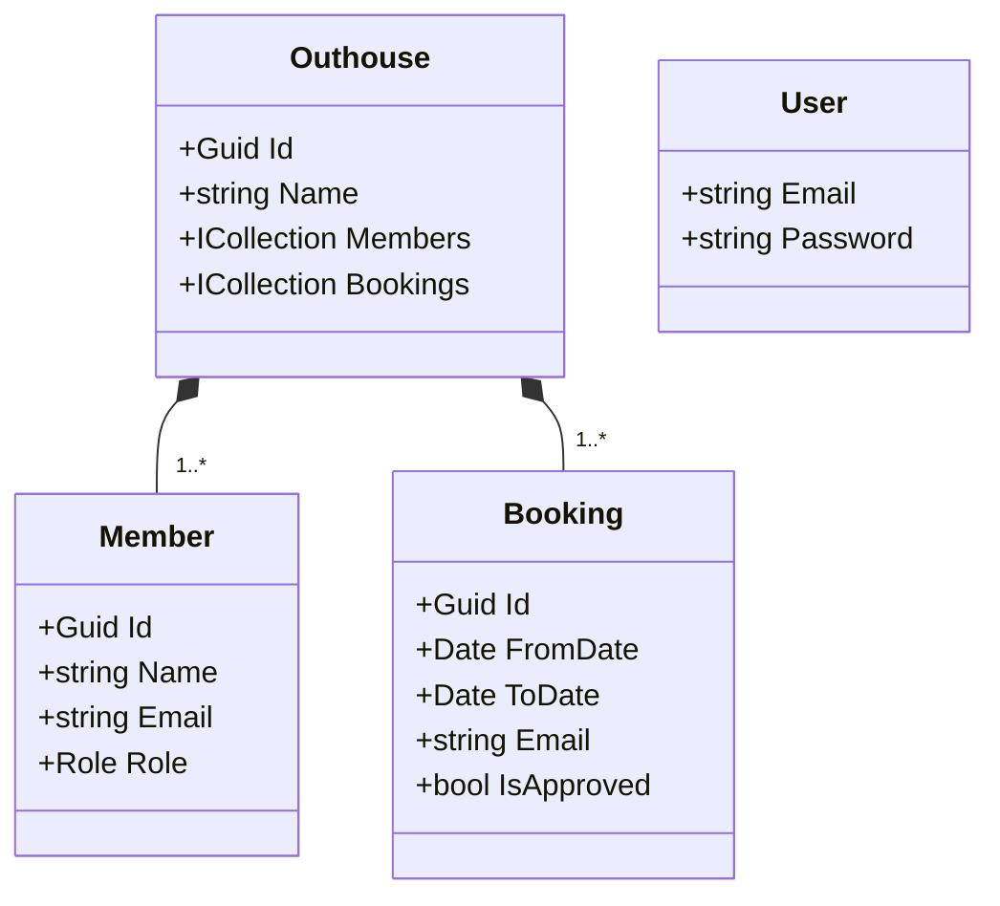

# Outhouse

Fun for the whole family...

## Architecture

The app uses ASP.NET to serve a React client-side SPA and a server-side API. The app connects to an MS SQL Server database. The back-end uses an Onion architecture pattern, somewhat akin to [this example](https://code-maze.com/onion-architecture-in-aspnetcore/). We define the following layers: 

- **Domain**
- **Service**
- **Infrastructure**
- **Presentation**

Our domain model looks something like this: 



The application also has users, with their e-mail as username. There is a weak coupling between the member `Email` field, and the `Email` field in the bookings and membership. This means you can add bookings and memberships to outhouses based on an e-mail address, even if that user does not have an account yet. Let's see how this develops over time.

## Setup development environment

To develop, you need to have .NET 8 installed, and node.js. Furthermore, you need to have the .NET EF tools:

```
dotnet tool install --global dotnet-ef
```

Local development and running the test project require a MS SQL Server to be reachable at localhost:1443. The easiest, cross-platform way to do this is by running it in a Docker container, like so:

```PowerShell
docker run `
    --name mssql `
    -e "ACCEPT_EULA=Y" `
    -e "MSSQL_SA_PASSWORD=yourStrong(!)Password" `
    -p 1433:1433 `
    -d `
    mcr.microsoft.com/mssql/server:2022-latest
```

...or on Mac/Linux

```sh
docker run \
    --name mssql \
    -e "ACCEPT_EULA=Y" \
    -e "MSSQL_SA_PASSWORD=yourStrong(\!)Password" \
    -p 1433:1433 \
    -d \
    mcr.microsoft.com/mssql/server:2022-latest
```

Once you have done this once, you can restart the container using `docker start mssql`.

When there is an update to the datamodel, or when you are with a fresh database, you might need to apply the required migrations to the database. We're developing with a "code-first" approach, which means the models are defined in the code, and migrated from there (as opposed to defining them in a `*.EDMX` file). To do so, run:

```sh
dotnet ef database update --project ./OutHouse.Server/OutHouse.Server.csproj
```

This will ensure you have the correct tables in a database named "OutHouseDbLocal". Now you should be able to run the app as follows:

```sh
dotnet run --project ./OutHouse.Server/OutHouse.Server.csproj
```

This will launch both the front-end and the back-end separately.

## API 

The API has the following endpoints: 

Identity: 
- `POST api/register` - Create new user
- `PUT api/login` - Login user 

We use Microsoft ASP.NET Core Identity to manage user information, see [documentation](https://learn.microsoft.com/en-us/aspnet/core/security/authentication/identity-api-authorization?view=aspnetcore-8.0).

MeController: 
- `GET api/me` - Returns user information
- `GET api/me/outhouses` - Returns list of houses user is member of
- `GET api/me/bookings` - Returns list of all bookings of user (NOT IMPLEMENTED YET)

OuthouseController
- `POST api/outhouse` - create new outhouse
- `GET,DELETE api/outhouses/{id}` - get or delete outhouse

OuthouseMemberController
- `GET,POST api/outhouses/{id}/members` - get members of house, or create new
- `DELETE api/outhouses/{id}/members/{id}` - delete member

OuthouseBookingController (NOT IMPLEMENTED YET)
- `GET,POST api/outhouses/{id}/bookings` - get bookings of house, or create new
- `PUT,DELETE api/outhouses/{id}/bookings/{id}` - modify or delete booking
