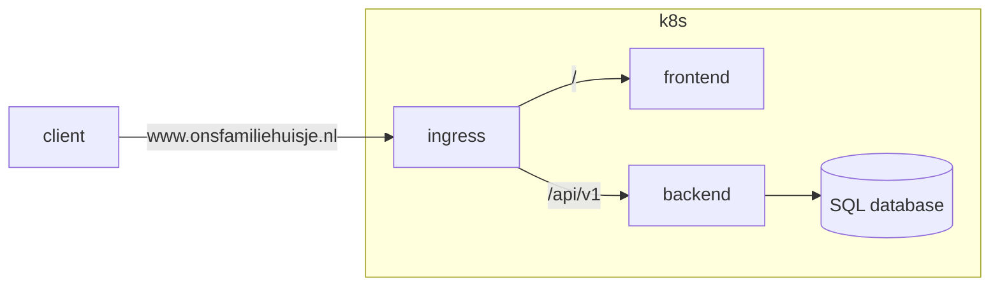

# Outhouse application 

Outhouse is a web-based appt that allows you and your family members to manage everything related to your family outhouse. Think of things like having a shared calender, budgetting, shopping and to-do list, guestbook, you name it...

## Architecture

The app has a pretty basic setup, with a front-end, a back-end, and a SQL database. For now, I deploy it on my Raspberry Pi based Kubernetes cluster; in future, I might migrate this to AWS or GCP. 

## Backlog

- [ ] Setup CI/CD with Github Actions 
- [ ] Basic front-end 
- [ ] Authentication
- [ ] Improve workflow scripts
- [ ] Improve API routing
- [ ] Implement DNS rules
