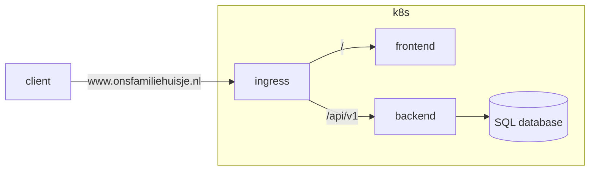

# Our Cottage

Our Cottage is a web-based appt that allows you and your family members to manage everything related to your family cottage. Think of things like having a shared calender, budgetting, shopping and to-do list, guestbook, you name it...

## Running

To run the full stack, do:

```bash
cd ./OutHouse.Server
dotnet run
```

This should bring up the backend by runnin the ASP.NET core application, and launch a SPA Proxy, to serve the front-end, with a redirect from `http://localhost:5157/` to `https://localhost:5173/`.

## Architecture

The app has a pretty basic setup, with a front-end, a back-end, and an SQL database. For now, I deploy it on my Raspberry Pi based Kubernetes cluster; in future, I might migrate this to AWS or GCP.



## Backlog

- [x] Setup CI/CD with Github Actions
- [x] Improve workflow scripts
- [ ] Improve API routing
- [ ] Back-end unittests
- [ ] Basic front-end
- [ ] Authentication
- [ ] Implement DNS rules
