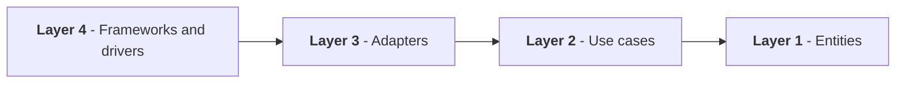
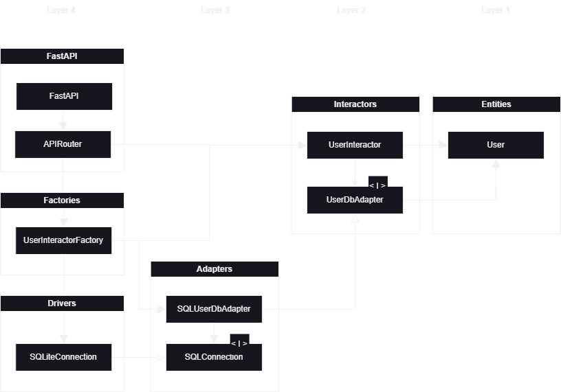

# My Cottage API

Very basic back-end API, for now it just handles users and calender end-points. 

## Architecture 

On a high level, the architecture of the app consists of the four levels described by Uncle Bob in [Clean Architecture](). 



Dependency only flows down (e.g. from layer 4 to 3, or from 2 to 1), never up, preventing cylcic graphs from occuring. This setup makes it easy to swap out front-end frameworks or database, test the different parts of the logic, and develop parts of the application in isolation. The figure below shows the implementation of this framework for the user management workflow.



The lowest layer consists of the entities, in our case, simply the `User` class. 

The second layer contains the use cases. For now, this is the `UserInteractor`, that handles the logic of creating, reading, updating and deleting a user. It also includes an interface for a `UserDbAdapter`. This is a form of dependency inversion. Since the database driver is a level 4 object, and the database adapter a level 3 object, and we can't depend on a concrete implementation, we specific an interface, that can be implemented in higher levels. 

The third layer contains adapters - in this case the SQL adapter, that implements `UserDbAdapter`. This class is responsible for implementing the SQL specific code that changes the database format, into the format that our level 2 classes understand. Notice how this is basically a description of an ORM. 

There is a bit of a tricky part here: to be able to execute this, it has to know of a database driver. Python specifies PEP249, which in theory would be enough to define the interface with the specific driver. However, I haven't been able to find an out-of-the-box type definition for this protocol, so I created my own, more strict type, using the `SQLConnection` interface.  

The fourth layer contains the implementations of the web framework (i.e. `FastAPI` and `APIRouter`), the specific implementations of `SQLConnection` (e.g. for SQLite or MySQL), and a factory class, used by the FastAPI dependency injection framework for generating instances of `UserInteractor` for handling every request. 

Finally, we have a `main.py` file, that instantiates the app, router, and user interface factory, tying it all together. 

## Developing 

Development requires Python and Poetry. With that in place, run: 

```bash
poetry install
```

...and you should be good to go. 

The `scripts` folder contains several useful scripts: 

* `build.sh` - builds the Docker image 
* `clean.sh` - cleans all non-controlled files (e.g. virtual environment / cache)
* `reset_test_db.sh` - creates a new test database; requires `sqlite3` CLI to be installed
* `format.sh` - applies auto-formatting 
* `test.sh` - runs tests 
* `serve.sh` - serves the app

Note that these scripts should either be run using `poetry run`, or with the created venv activated. 

A debug launcher is also configured for VSCode - simply hit F5. 

## CI/CD 

I'm using GitHub Actions on this project, configured in `../.github/workflows/`. The CI/CD is limited to testing, building and pushing of a Docker image. Deploying is (for now) still a manual task. The image is pushed to `janheindejong/my-cottage-api:latest` for both `arm64` and `amd64`. 
