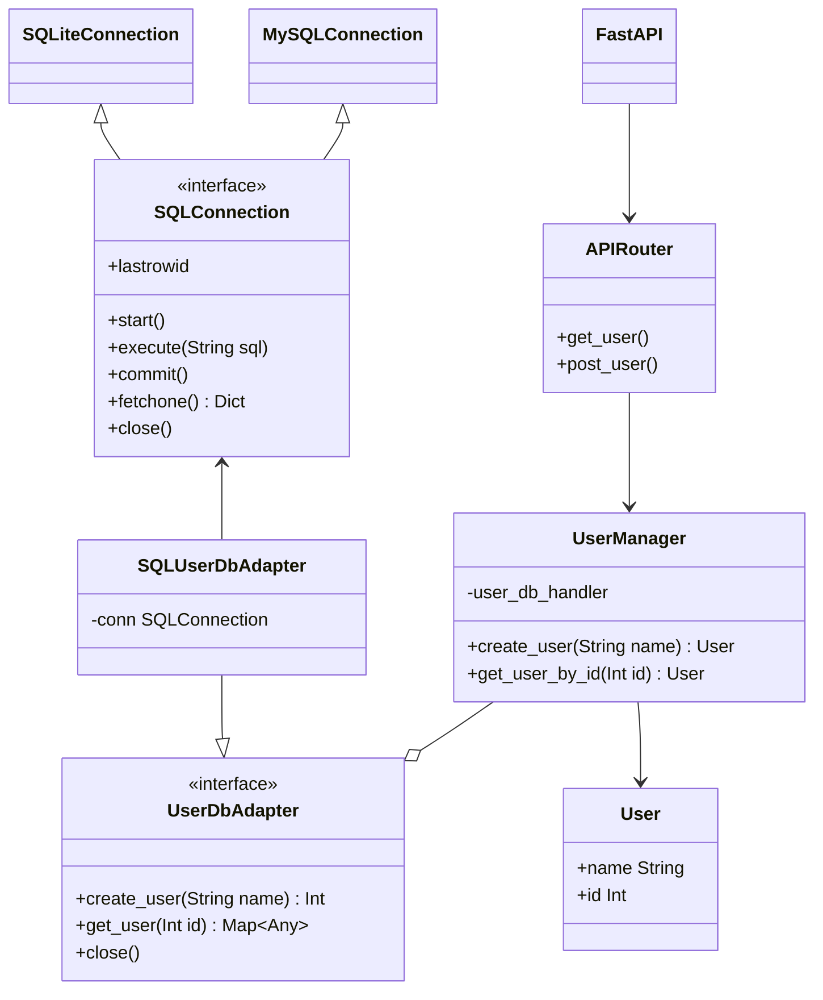

# Outhouse API

Very basic back-end API, for now it just handles users and calender end-points. 

## Structure 

The configuration of the API is found in [`outhouse/api/routers`](./outhouse/api/routers/). Each top-level end-point has its own `*.py` file, containing the definition of the end-point. Schemas can be found in [`outhouse/api/schemas.py`](./outhouse/api/schemas.py). 

## Architecture 

For the architecture, I try to implement lessons from [Clean Architecture]() by Uncle Bob. 

The lowest layer consists of the entities, i.e. the `User` class. The second layer contains the use cases - in this case the `UserManager` and corresponding `UserDbAdapter` interface. The third layer contains adapters - in this case the SQL adapter, that implements `UserDbAdapter`. The fourth layer contains the implementations of the web framework (i.e. `FastAPI` and `APIRouter`), and the specific database drivers. 

We use dependency inversion in two places: with the `UserDbAdapter` interface, and the `SQLConnection` interface. Although `PEP249` specifies an interface for the latter, this is not really strictly enforced by the different drivers, so we end up having to create some logic to wrap these drivers in `SQLiteConnection` and `MySQLConnection`.



## Developing 

Development requires Python and Poetry. With that in place, run: 

```bash
poetry install
```

...and you should be good to go. 

The `scripts` folder contains several useful scripts: 

* `build.sh` - builds the Docker image 
* `format.sh` - applies auto-formatting 
* `test.sh` - runs tests 
* `serve.sh` - serves the app

Note that these scripts should either be run using `poetry run`, or with the created venv activated. 

A debug launcher is also configured for VSCode - simply hit F5. 

## CI/CD 

I'm using GitHub Actions on this project, configured in `../.github/workflows/`. The CI/CD is limited to testing, building and pushing of a Docker image. Deploying is (for now) still a manual task. The image is pushed to `janheindejong/outhouse-api:latest` for both `arm64` and `amd64`. 
