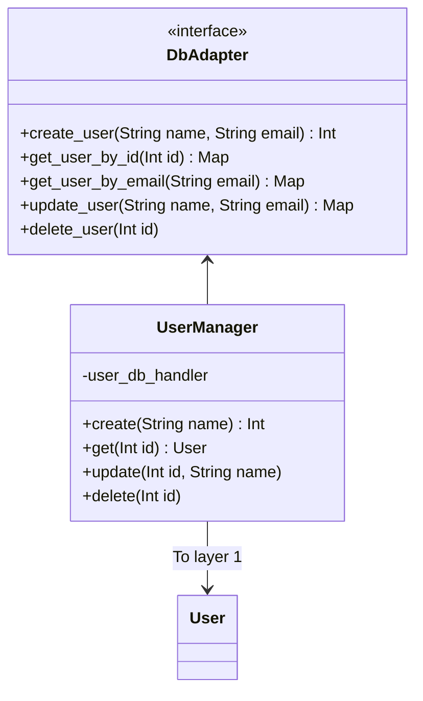
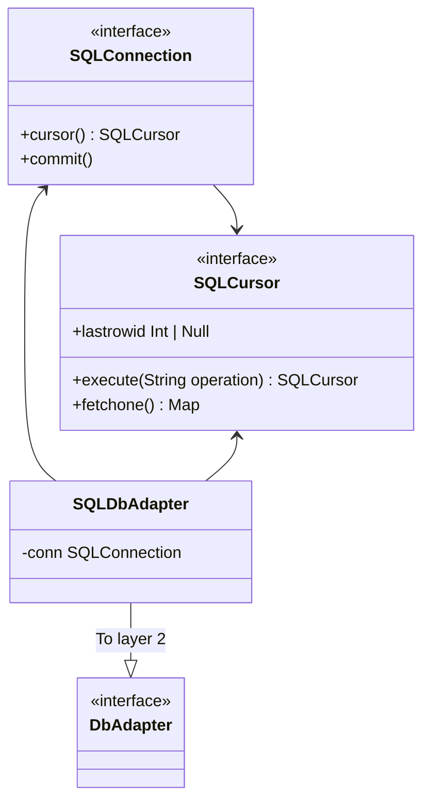
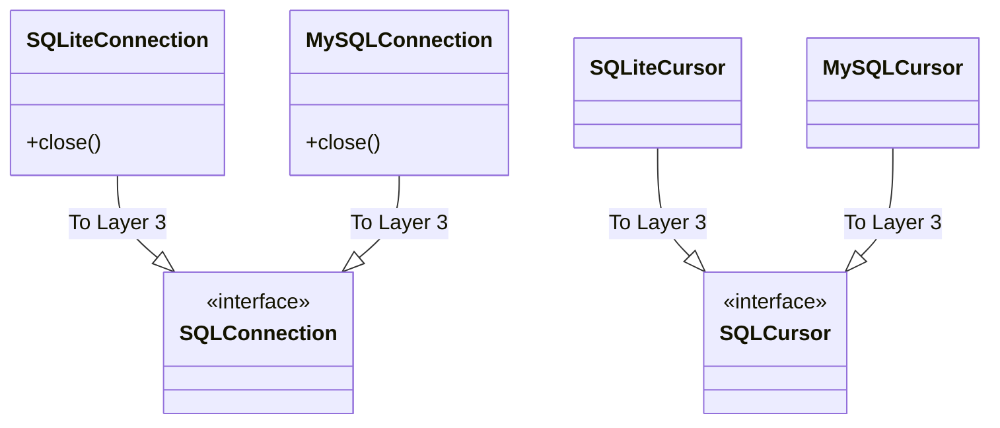

# My Cottage API

Very basic back-end API, for now it just handles users and calender end-points. 

## Structure 

The configuration of the API is found in [`app/api/routers`](./app/api/routers/). Each top-level end-point has its own `*.py` file, containing the definition of the end-point. Schemas can be found in [`app/api/schemas.py`](./app/api/schemas.py). 

## Architecture 

On a high level, the architecture of the app consists of the four levels described by Uncle Bob in [Clean Architecture](). 


Dependency only flows down (e.g. from layer 4 to 3, or from 2 to 1), never up. The lowest layer consists of the entities, in our case, simply the `User` class. 


The second layer contains the use cases. For now, this is the `UserManager`, that handles the logic of creating, reading, updating and deleting a user. It also includes an interface for a `UserDbAdapter`. This is a form of dependency inversion. Since the database driver is a level 4 object, and the database adapter a level 3 object, and we can't depend on a concrete implementation, we specific an interface, that can be implemented in higher levels. 



The third layer contains adapters - in this case the SQL adapter, that implements `DbAdapter`. This class is responsible for implementing the SQL specific code that changes the database format, into the format that our level 2 classes understand. Now here's a bit of a tricky part: to be able to execute this, it has to know of a database driver. Python specifies PEP249, which in theory would be enough to define the interface with the specific driver. However, I haven't been able to find an out-of-the-box type definition for this protocol, so I created my own, more strict type, using the `SQLConnection` and `SQLCursor` interfaces.  



The fourth layer contains the implementations of the web framework (i.e. `FastAPI` and `APIRouter`), and the specific implementations of `SQLConnection` and `SQLCursor` (e.g. for SQLite or MySQL).



This setup makes it easy to swap out front-end frameworks or database, and test the different parts of the logic. 

## Developing 

Development requires Python and Poetry. With that in place, run: 

```bash
poetry install
```

...and you should be good to go. 

The `scripts` folder contains several useful scripts: 

* `build.sh` - builds the Docker image 
* `clean.sh` - cleans all non-controlled files (e.g. virtual environment / cache)
* `reset_test_db.sh` - creates a new test database; requires `sqlite3` CLI to be installed
* `format.sh` - applies auto-formatting 
* `test.sh` - runs tests 
* `serve.sh` - serves the app

Note that these scripts should either be run using `poetry run`, or with the created venv activated. 

A debug launcher is also configured for VSCode - simply hit F5. 

## CI/CD 

I'm using GitHub Actions on this project, configured in `../.github/workflows/`. The CI/CD is limited to testing, building and pushing of a Docker image. Deploying is (for now) still a manual task. The image is pushed to `janheindejong/my-cottage-api:latest` for both `arm64` and `amd64`. 
